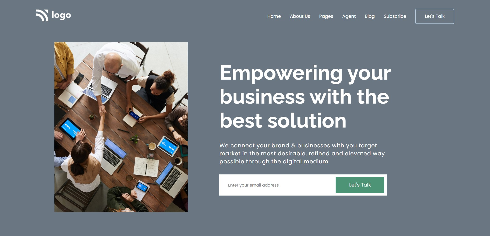

# Project 12 - HTML  and CSS 

By Shubham

Here's the Live Deployed Website 

## [DEPLOYED WEBSITE LINK](https://businesssolution.netlify.app/)

## What I learned from this Project?

- I learned about **layout** making through **Flexbox & Grid**.
- I also learned how to make a full fledged website end to end.
- I also learned how to make resuable Buttons.
- I also learned about making beautiful **Reusable Cards**.
- I also added a good **footer**.

## This project took around **5 hours** to complete.
